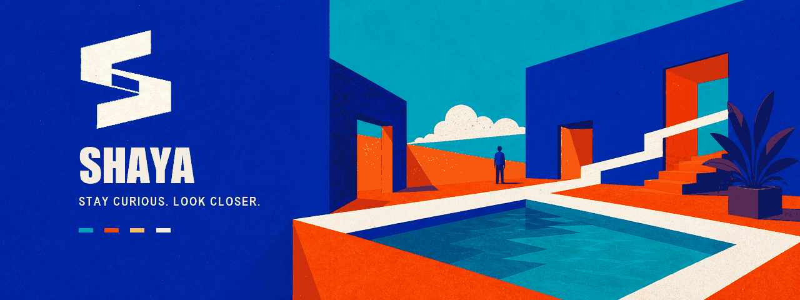
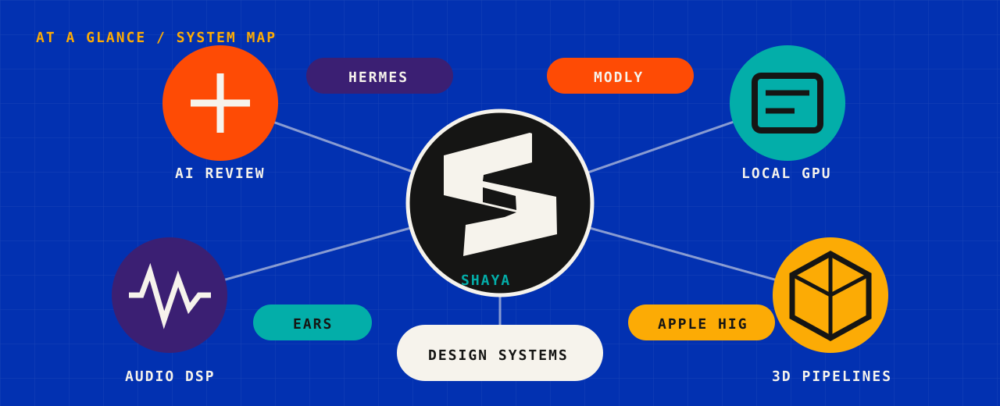
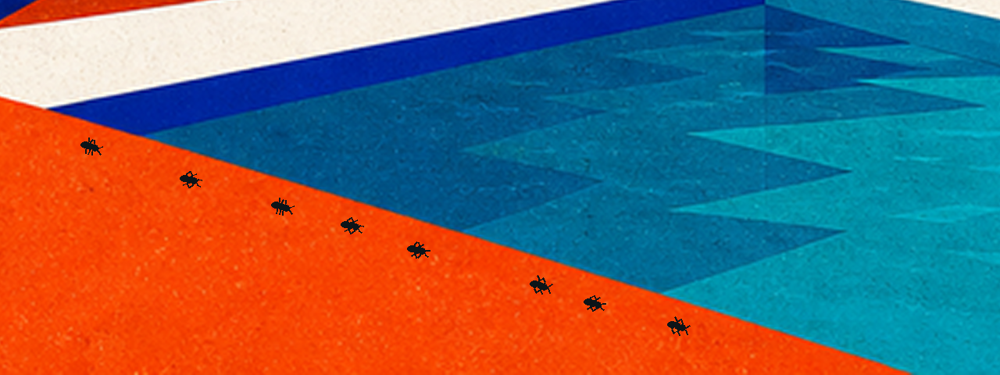
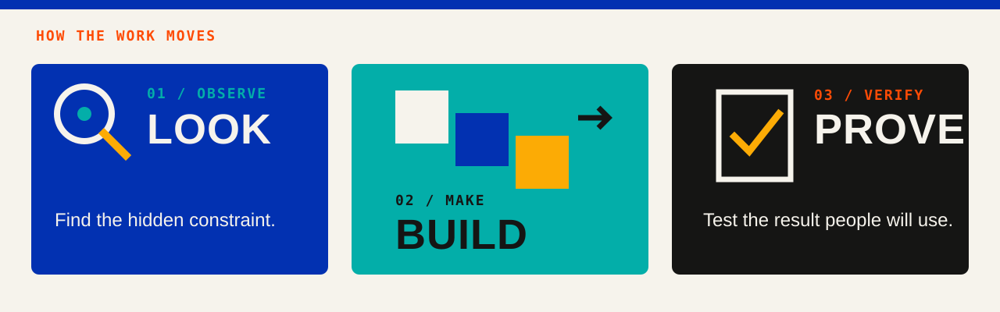
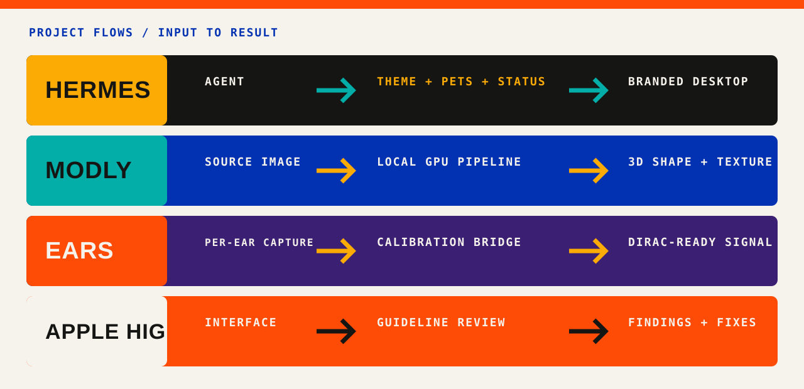
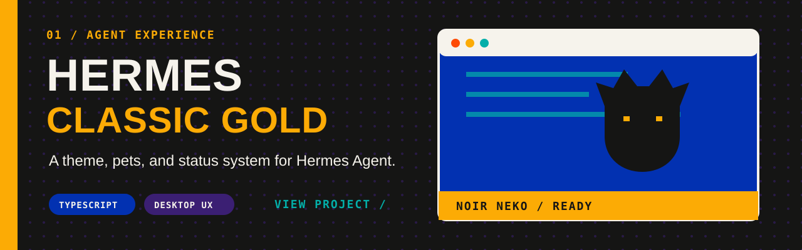
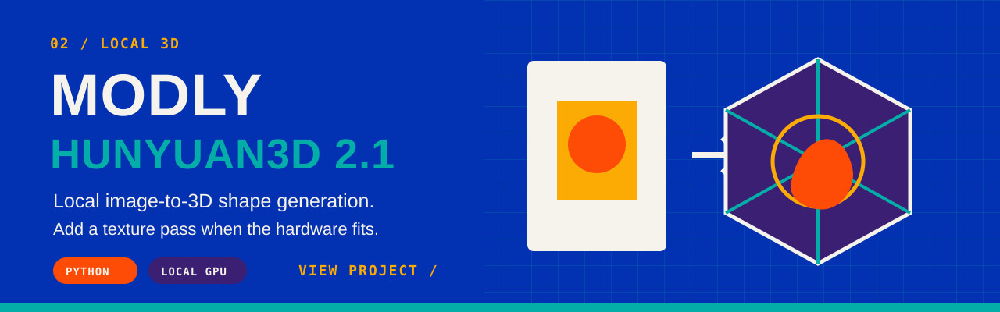
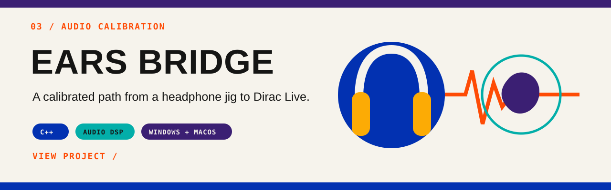
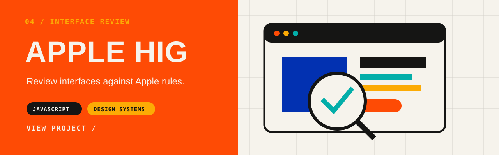
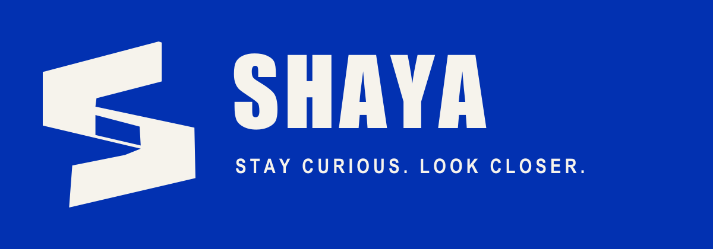

  

  <strong>I build tools that make complex AI, GPU, 3D, and audio systems easier to inspect, test, and use.</strong>

  <a href="#selected-work">Explore the work</a>
  &nbsp;&nbsp;/&nbsp;&nbsp;
  <a href="#how-the-work-moves">See the method</a>
  &nbsp;&nbsp;/&nbsp;&nbsp;
  <a href="#more">Open the details</a>

## At a glance

  

  
   
  <strong>The useful signal is often in the detail.</strong>

## How the work moves

  

## Selected work

  

 

 

 

## More

  
<strong>Current focus and toolbox</strong>

   

  **Now:** independent AI review, local GPU systems, evidence-backed
  developer tools, and reproducible technical documentation.

  **Build:** Python, TypeScript, JavaScript, C++, and HTML/CSS.

  **Systems:** local LLMs, AI agents, GPU inference, GitHub Actions,
  Windows, macOS, and audio DSP.

  
<strong>Signal Color identity kit</strong>

   

  - [Brand guidelines](./brand/SHAYA-SIGNAL-COLOR-GUIDELINES.md)
  - [PDF guide](./brand/SHAYA-Signal-Color-Brand-Guidelines.pdf)
  - [Editable PowerPoint](./brand/SHAYA-Signal-Color-Brand-Guidelines.pptx)
  - [Vector logo master](./brand/assets/shaya-signal-color-mark-light.svg)
  - [Design tokens](./brand/brand-tokens.json)
  - [All identity assets](./brand/assets)

  

    
  

  

