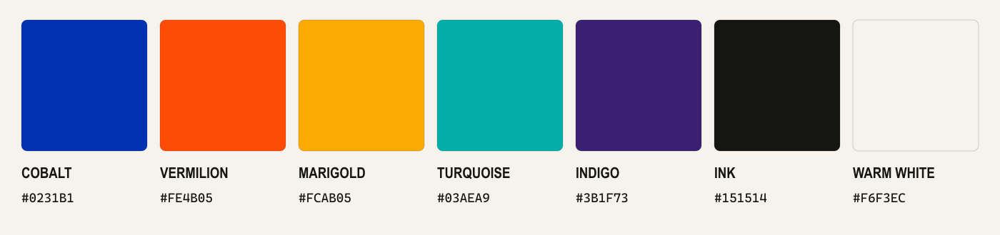

  

  <strong>Developer tools, local AI systems, 3D pipelines, and audio engineering.</strong>
   
  I turn uncertain technical systems into clear, tested results.

  <a href="#selected-work">Selected work</a>
  ·
  <a href="#current-focus">Current focus</a>
  ·
  <a href="#how-i-work">How I work</a>
  ·
  <a href="#identity-kit">Identity kit</a>

---

## Stay curious. Look closer.

I build practical tools for systems that are difficult to inspect. My work
spans AI agents, local model workflows, GPU inference, developer experience,
3D generation, and audio systems.

I prefer small tests, explicit limits, and documentation that separates
confirmed facts from inference.

## Selected work

<table>
  <tr>
    <td width="50%" valign="top">
      <h3>
        <a href="https://github.com/Elevatormusic/hermes-classic-gold-pack">
          Hermes Classic Gold Pack
        </a>
      </h3>
      

        A Classic Gold theme, Noir Neko pets, and a custom status bar for
        Hermes Agent. It includes a one-prompt installation path.
      

      
<code>TypeScript</code> <code>Agent UX</code> <code>Desktop</code>

    </td>
    <td width="50%" valign="top">
      <h3>
        <a href="https://github.com/Elevatormusic/modly-hunyuan3d-2-1-shape-extension">
          Modly Hunyuan3D 2.1
        </a>
      </h3>
      

        A local image-to-3D extension with high-fidelity shape generation and
        an optional PBR texture pass.
      

      
<code>Python</code> <code>Local GPU</code> <code>3D</code>

    </td>
  </tr>
  <tr>
    <td width="50%" valign="top">
      <h3>
        <a href="https://github.com/Elevatormusic/ears-bridge">
          EARS Bridge
        </a>
      </h3>
      

        A Windows and macOS bridge for using a miniDSP EARS headphone jig with
        Dirac Live through per-ear calibration and a virtual audio device.
      

      
<code>C++</code> <code>Audio DSP</code> <code>Calibration</code>

    </td>
    <td width="50%" valign="top">
      <h3>
        <a href="https://github.com/Elevatormusic/apple-hig">
          Apple HIG
        </a>
      </h3>
      

        A Claude Code plugin that designs and reviews interfaces against
        Apple Human Interface Guidelines across the Apple platform family.
      

      
<code>JavaScript</code> <code>UI Review</code> <code>Design Systems</code>

    </td>
  </tr>
</table>

## Current focus

- Independent AI review and repair workflows.
- Local model integration and GPU memory efficiency.
- Evidence-backed evaluation of developer tools.
- Security checks and reproducible technical documentation.

## How I work

| Build | Verify | Explain |
| --- | --- | --- |
| Make the smallest useful system. | Test the claim in the form people will use. | Record the evidence, scope, and remaining limits. |

**Working principle:** confidence should follow evidence, not replace it.

## Toolbox

`Python` · `TypeScript` · `JavaScript` · `C++` · `HTML/CSS`

`Local LLMs` · `AI agents` · `GPU inference` · `GitHub Actions`
· `Windows` · `macOS` · `Audio DSP`

## Identity kit

This profile and its complete identity kit use the **Signal Color** system.

- [Read the brand guidelines](./brand/SHAYA-SIGNAL-COLOR-GUIDELINES.md)
- [Download the PDF guide](./brand/SHAYA-Signal-Color-Brand-Guidelines.pdf)
- [Download the editable PowerPoint](./brand/SHAYA-Signal-Color-Brand-Guidelines.pptx)
- [Browse the Signal Color assets](./brand/assets)
- [Use the design tokens](./brand/brand-tokens.json)

  
<strong>View the Signal Color palette</strong>

   
  

    
  

---

  Build carefully. Verify honestly. Explain clearly.

