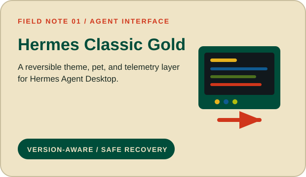
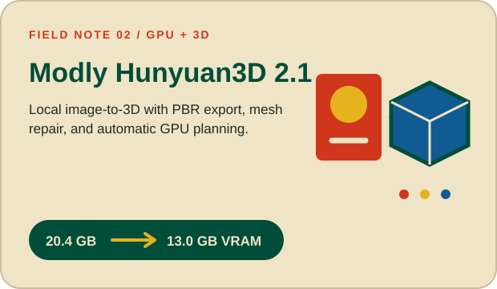
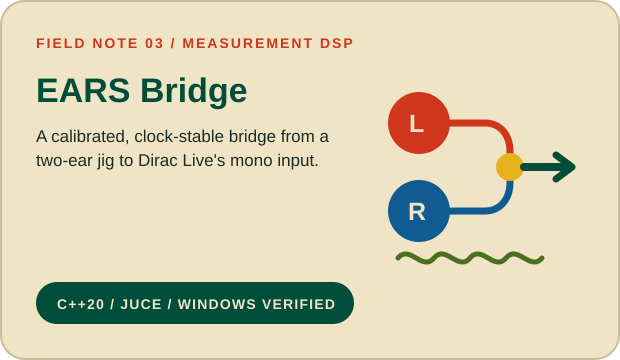
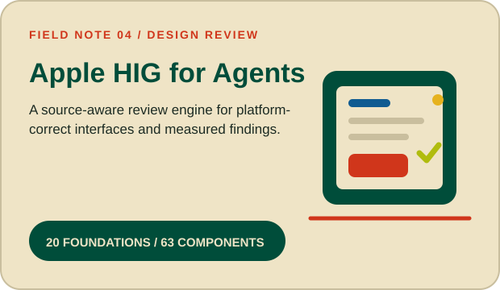
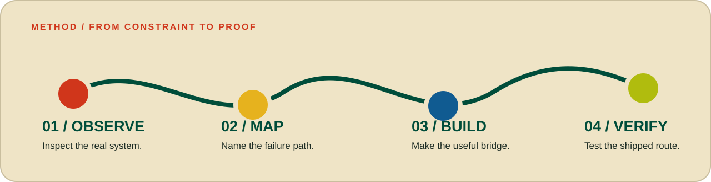

  

  <strong>Software engineer and designer for AI and hardware tools.</strong>
   
  I turn complex workflows into clear desktop software. I prove each result with tests, measurements, and reproducible documentation.

  Agent interfaces · local image-to-3D · measurement DSP · automated design review

  <a href="#selected-work">Selected work</a>
  &nbsp;&nbsp;·&nbsp;&nbsp;
  <a href="#how-i-work">How I work</a>
  &nbsp;&nbsp;·&nbsp;&nbsp;
  <a href="#current-focus">Current focus</a>

## Selected work

  
  

  
  

## How I work

  

The constraint changes: upstream code, GPU memory, clock drift, or design authority. The standard does not. I test the real path, keep changes reversible, and state what remains unverified.

## Current focus

I am working on independent agent review, local GPU workflows, and interfaces that make system behavior and limits easy to inspect.

**Working range:** Python, TypeScript and JavaScript, C++ and JUCE, GitHub Actions, Windows and macOS, local LLMs, GPU inference, and audio DSP.

## Start here

If you are working on an AI or hardware workflow that needs a clearer route from experiment to proof, start with the project nearest your problem or [browse all repositories](https://github.com/Elevatormusic?tab=repositories).

  

