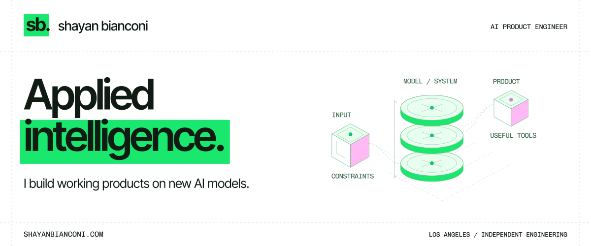

<a href="https://shayanbianconi.com/">
  <picture>
    <source media="(max-width: 600px) and (prefers-color-scheme: dark)" srcset="./assets/portfolio/profile-header-mobile-dark.svg">
    <source media="(max-width: 600px)" srcset="./assets/portfolio/profile-header-mobile.svg">
    <source media="(prefers-color-scheme: dark)" srcset="./assets/portfolio/profile-header-dark.svg">
    
  </picture>
</a>

**AI Product Engineer · Los Angeles** 
[Portfolio](https://shayanbianconi.com/) · [hello@shayanbianconi.com](mailto:hello@shayanbianconi.com) · [LinkedIn](https://www.linkedin.com/in/shayan-bianconi/) · [Repositories](https://github.com/Elevatormusic?tab=repositories)

Two of my pull requests are merged upstream, and three more are in review, including vLLM and Hermes Agent.

## Selected work

### 01 / WaveGrating

**Wave optics for Blender.** Common renderers can't compute the colors of a CD, a banknote hologram, or a holographic Pokémon card. I'm building WaveGrating to render them accurately.

**Research in progress.** The research covers diffraction, interference, polarization, and partial coherence in supported optical scenes.

[Read the WaveGrating case study](https://shayanbianconi.com/work/wavegrating/)

`Python` `PyTorch` `CUDA` `Blender`

### 02 / Modly × Hunyuan3D

**Image to 3D on 16 GB cards.** An image becomes a textured 3D asset. The texture pass reserved 20.4 GB of GPU memory, more than a 16 GB card holds. I staged components between CPU and GPU so idle weights no longer occupied the GPU.

In one recorded RTX 3090 texture-pass benchmark, reserved GPU memory fell from 20.4 GB to 13.0 GB, 36% less, and the pass took 116 s, up from 111 s.

[Read the Modly case study](https://shayanbianconi.com/work/modly/) · [Source on GitHub](https://github.com/Elevatormusic/modly-hunyuan3d-2-1-shape-extension)

`Python` `PyTorch` `CUDA`

### 03 / EARS Bridge

**Dirac Live on an EARS jig.** The bridge connects the miniDSP EARS headphone measurement jig to Dirac Live. Per-ear calibration and automatic selection keep the two ears' measurements separate, and a drift-correcting sample-rate converter holds one fixed ratio during each sweep.

**Public alpha.** The Windows build is tested on hardware.

[Read the EARS Bridge case study](https://shayanbianconi.com/work/ears/) · [Website and downloads](https://elevatormusic.github.io/ears-bridge/)

`C++20` `JUCE 8` `Catch2`

### 04 / Local AI Systems

**Self-hosted AI for coding.** I run GLM-5.3-Flash, a 320-billion-parameter model, on two NVIDIA DGX Spark computers for my coding tools. I adapt community deployment recipes and fix what breaks on my hardware. Then I add the tooling around them: a shared API, health checks, startup automation, and recovery.

**Merged upstream.** My prefix-cache fix and memory field report are now part of tonyd2wild's recipe for this model.

[Read the Local AI case study](https://shayanbianconi.com/work/local-ai/) · [My fork of the recipe](https://github.com/Elevatormusic/GLM-5.3-Flash-NVFP4-DFlash2-2x-DGX-Spark)

`vLLM` `Docker` `Linux` `Python`

### 05 / Hermes Classic Gold

**Agent telemetry in one tape.** A theme and telemetry pack for Hermes Desktop. The tape shows the state of an agent run at a glance.

**Open source.** The backend reads context, cache hits, and cost from the session record, and it never reads message text.

[Read the Hermes Classic Gold case study](https://shayanbianconi.com/work/hermes/) · [Source on GitHub](https://github.com/Elevatormusic/hermes-classic-gold-pack)

`JavaScript` `Python` `Hermes plug-in SDK`

### 06 / Warm Compaction

**Faster context compaction for Hermes Agent.** When a long agent session fills its context window, Hermes asks a model to summarize the history. That request starts a new prompt, so the server reads the whole history again. My plugin sends the last request once more with a handoff instruction at the end, so the server reuses its prompt cache and the main model writes the summary from the full history.

In ten recorded sessions of about 105,000 tokens on DGX, the median compaction took 16.8 s, against 43.5 s for hermes-lcm and 78.5 s for the built-in compressor, and the agent kept 59 of 60 compacted facts, against 43 and 50.

**Open source.** It runs on unpatched Hermes through documented plugin APIs only. An in-core version is open as a draft pull request to Hermes Agent.

[Source and results on GitHub](https://github.com/Elevatormusic/hermes-warm-compaction) · [Draft pull request to Hermes Agent](https://github.com/NousResearch/hermes-agent/pull/133625)

`Python` `Hermes plug-in SDK` `Prompt caching`

**Also:** [Apple HIG for Agents](https://github.com/Elevatormusic/apple-hig), a Claude Code plugin that designs and reviews interfaces with Apple's Human Interface Guidelines for iOS, iPadOS, macOS, watchOS, tvOS, and visionOS. [Examples and live demo](https://elevatormusic.github.io/apple-hig/)

## Open source contributions

When a tool I use breaks, I trace the fault and send its maintainers a fix or a field report.

- **[Prefix-cache repair for the drafter group](https://github.com/tonyd2wild/GLM-5.3-Flash-NVFP4-DFlash2-2x-DGX-Spark/pull/18)** 
  Merged · tonyd2wild's GLM-5.3-Flash DGX Spark recipe · September 16, 2026 
  The cache never hit on this recipe. With the fix, the time to first token for a repeated 262,144-token prompt fell from 191.7 s to 2.98 s.
- **[GB10 unified-memory field report](https://github.com/tonyd2wild/GLM-5.3-Flash-NVFP4-DFlash2-2x-DGX-Spark/pull/19)** 
  Merged · tonyd2wild's GLM-5.3-Flash DGX Spark recipe · September 16, 2026 
  Documents the load guard, the startup-check trap, and fault gating for the shared memory of a DGX Spark.
- **[Cut transient memory in NVFP4 Marlin scale-factor computation](https://github.com/vllm-project/vllm/pull/55103)** 
  In review · vLLM 
  Weight loading copied the scales of every expert at once. On a test tensor one eighth of production size, memory growth fell from 1,011 MiB to 3 MiB.
- **[Separate context usage and preserve acting output budgets](https://github.com/NousResearch/hermes-agent/pull/109388)** 
  In review · Hermes Agent, Nous Research 
  Hermes counted an 8,000-token acting request and a 230,000-token advisor request as one 238,000-token context. The fix measures context from the acting request.
- **[Rearm the compaction budget after LCM progress](https://github.com/stephenschoettler/hermes-lcm/pull/586)** 
  In review · hermes-lcm, a Hermes plug-in 
  After three compactions in one long turn, automatic compaction stopped. A new test runs five compactions in one turn.

**On the GB10 field report**

> "This is the most useful GB10 memory write-up anyone has sent us"
>
> The recipe's maintainer tonyd2wild, [on GitHub](https://github.com/tonyd2wild/GLM-5.3-Flash-NVFP4-DFlash2-2x-DGX-Spark/pull/19#issuecomment-5702499681)

**On the Modly extension**

> "thanks again for the extension, it's brilliant!"
>
> Modly collaborator Lorchie, [on GitHub](https://github.com/lightningpixel/modly/issues/215#issuecomment-4949058663)

## A little about me

I'm Shayan, an independent AI product engineer based in Los Angeles.

Most of my work is what comes after a model runs once: the installer, the memory budget, the health checks, and the docs. My background is in audio, hardware, and simulation, where a result counts only if you can measure it again. I test on my own machines and publish the numbers.

I'm open to full-time AI product engineering roles. Email [hello@shayanbianconi.com](mailto:hello@shayanbianconi.com) or visit [my portfolio](https://shayanbianconi.com/).
